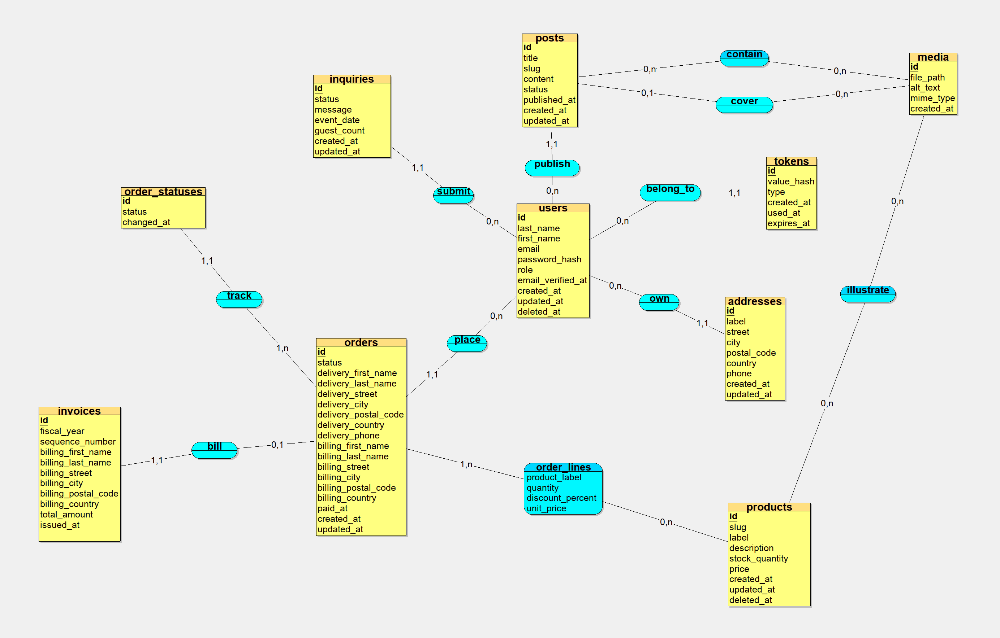

# Piment Doux

Backend for Piment Doux, an online shop and catering business: product catalogue,
customer accounts, orders and invoices, catering inquiries, and a blog.

> **Status: early development.** The data model and the API contract are designed
> first. The HTTP endpoints are not implemented yet. This README lists what is done,
> what is in progress and what comes next.

## Stack

- Node.js, TypeScript, Express 5
- PostgreSQL (15 or later)
- Prisma 8 (release candidate, exact version pins)
- OpenAPI 3.1 for the API contract

## Approach

- **Design first.** Conceptual data model (Merise MCD), then a hand-written SQL DDL
  as the design reference, then a Prisma contract kept aligned with it.
- **Integrity in the database.** Business rules are enforced with CHECK constraints
  and partial unique indexes, not only in application code.
- **Contract-first API.** The OpenAPI spec is written before the endpoints.
- **Small, atomic commits** following Conventional Commits with scopes.
- **AI as a reviewer, not a code generator.** I write the code; an AI assistant
  reviews it under the rules in `CLAUDE.md`.

## Data model highlights



- Soft delete on users and products, with partial unique indexes
  (`WHERE deleted_at IS NULL`): a slug or an email can be reused after deletion.
- Case-insensitive unique email (`UNIQUE` index on `lower(email)`).
- Historical records do not change when live data changes: order lines snapshot
  the product label and unit price, orders snapshot delivery and billing addresses,
  invoices snapshot the billing identity and total.
- Invoice numbers are unique per fiscal year (`fiscal_year`, `sequence_number`).
- Order status history in its own table.
- Business rules as constraints: guest users have no password, `paid_at` is required
  once an order is processing, shipped or delivered, a published post needs a
  `published_at`.
- Many-to-many media for products and posts.
- Email verification and password reset tokens are stored hashed.

## API design decisions

- Public read access to the catalogue; write operations are admin only.
- Numeric `id` as the API identifier; `slug` is returned as data for frontend URLs.
- Soft-deleted products return 404 publicly and stay visible and restorable for
  admins. Restoring a product whose slug was reused returns 409.
- Prices exposed as integer cents (`priceCents`, EUR).
- Stock: `inStock` boolean publicly, exact quantity for admins.
- Lists: `page`, `limit`, `sort`, `order`, `search`.
- Errors follow RFC 9457 (`application/problem+json`).

## Project status

### Done

- Conceptual data model (Merise MCD): `docs/pd-merise/`
- SQL DDL: `docs/pd.sql`
- Prisma contract with all models, enums, constraints and indexes:
  `src/prisma/contract.prisma`
- Initial database migration: `migrations/`
- Express server bootstrap in TypeScript
- OpenAPI 3.1 base: RFC 9457 problem schema and shared error responses:
  `docs/openapi.yaml`

### In progress

- Products API contract: public and admin schemas, paths, pagination
- Monetary columns: move from `DECIMAL(10,2)` to integer cents

### Next

- Products endpoints: public read, admin write, soft delete and restore
- Global error handling (problem+json) and request validation
- Authentication and roles (user, guest, admin)
- Orders, order status history and invoices
- Catering inquiries
- Blog and media
- Automated tests
- Continuous integration: spec lint, type check, tests

### Planned

- Vue.js 3 frontend
- Deployment with nginx on a VPS
- HubSpot CRM as a downstream consumer. The local PostgreSQL database stays the
  source of truth. The site writes locally, then pushes to HubSpot.

## Running locally

Requirements: Node.js (current LTS) and an empty PostgreSQL 15+ database.

```bash
npm ci
cp .env.example .env   # then set DATABASE_URL to an empty PostgreSQL database
npx prisma db migrate
npm run dev
```

The server starts on http://localhost:3000. Only a placeholder route exists for now.

## Repository layout

```
docs/
  pd.sql           Hand-written DDL (design reference)
  pd-merise/       Conceptual data model (Looping)
  openapi.yaml     API contract
migrations/        Prisma migrations
src/
  app.ts           Express app
  server.ts        Server startup
  prisma/          Prisma contract and database client
```
